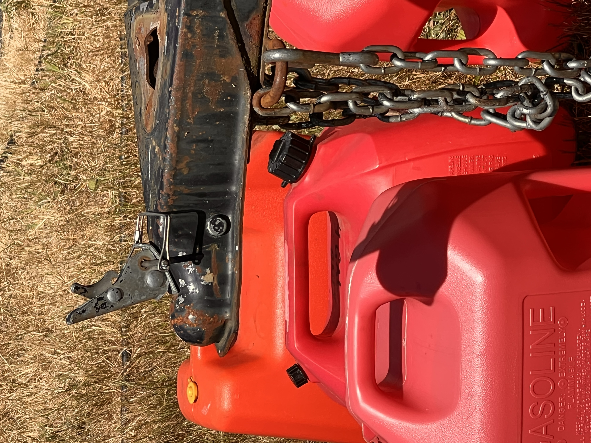
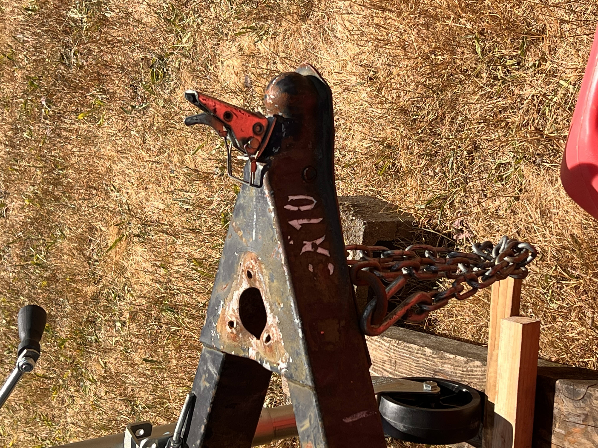
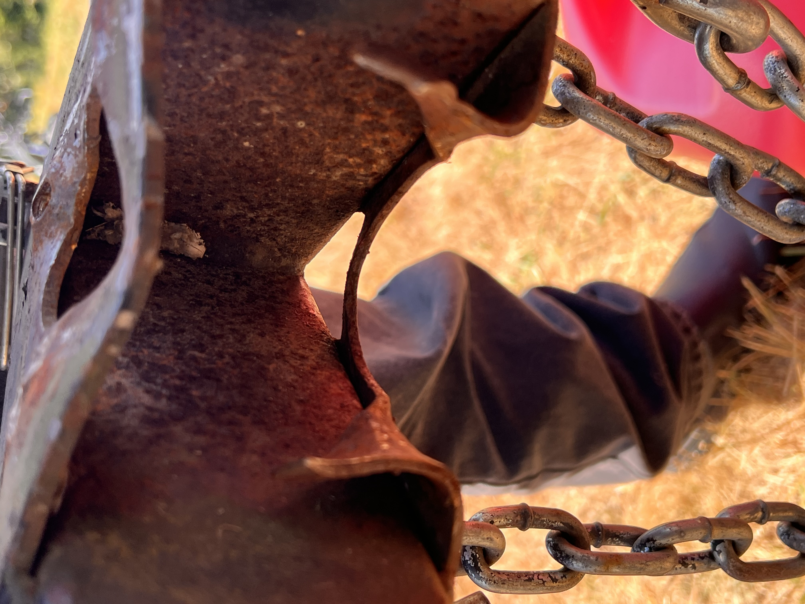
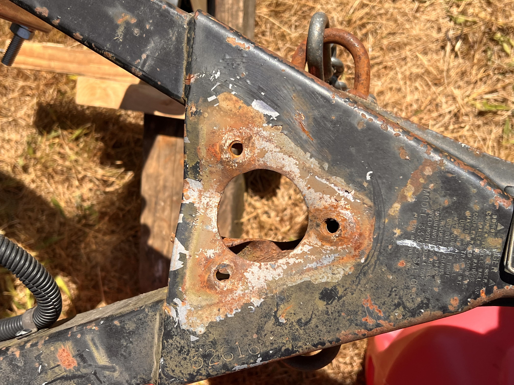
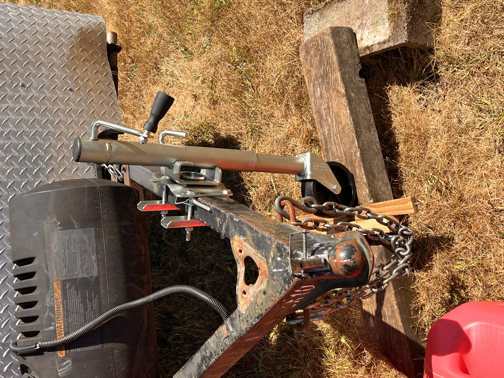
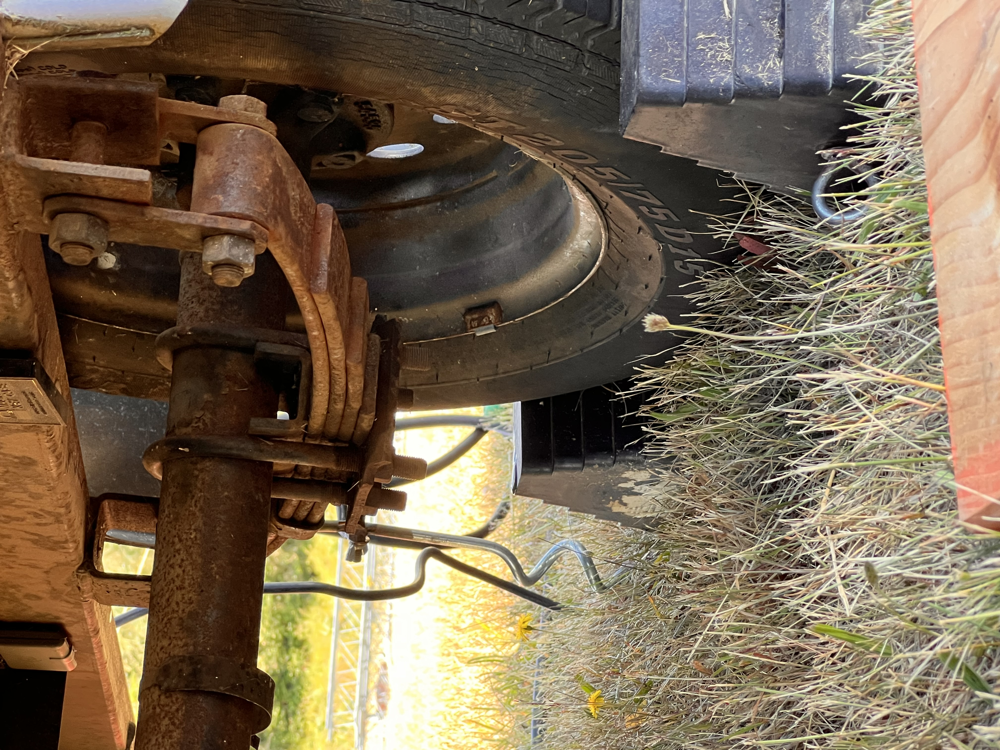
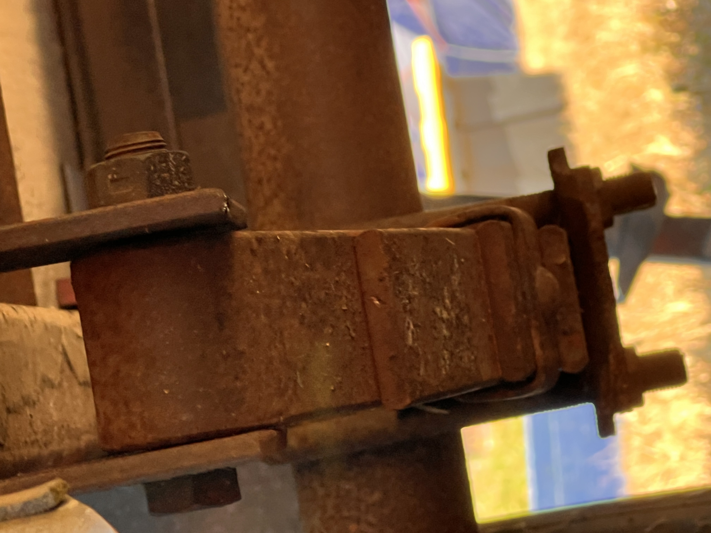
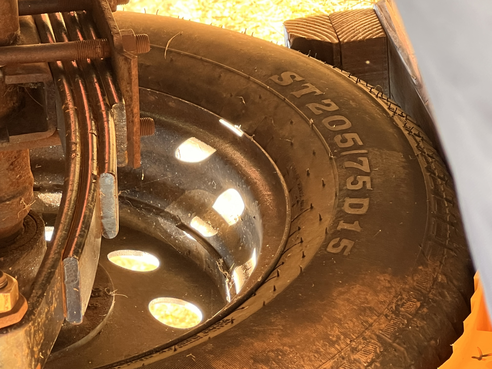
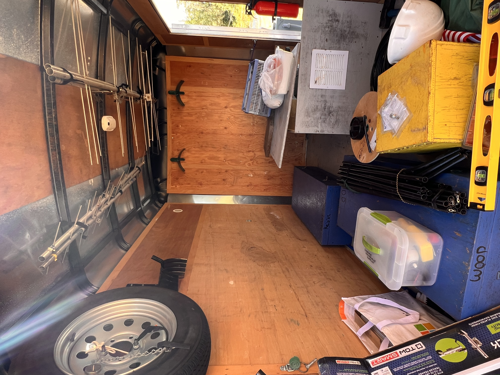
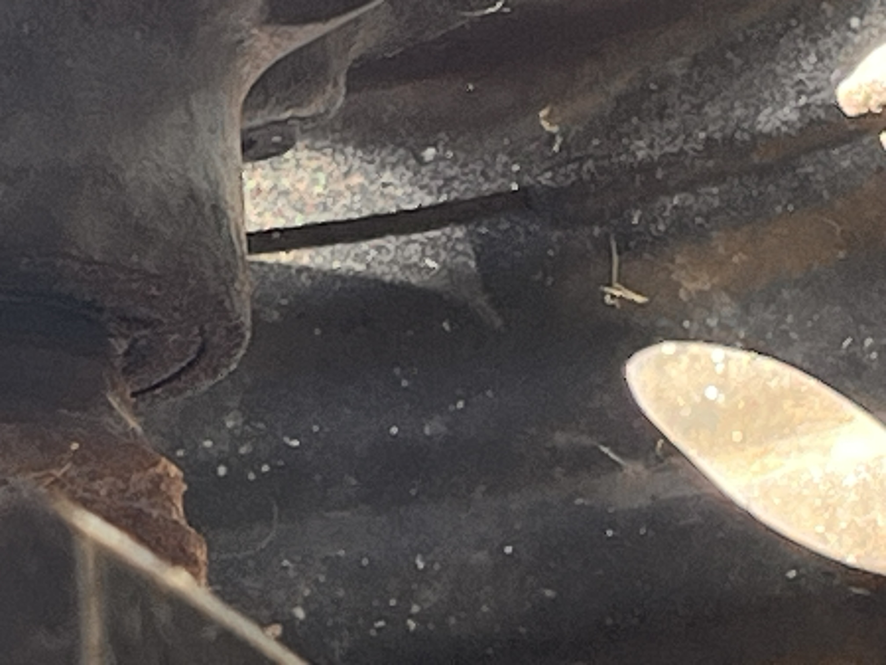

# M&K Field Day 2026 — After Action Discussion
**Source:** Zoom Meeting Closed Caption Transcript  
**Segment:** 10:35:10 – 10:57:40

---

## Speakers Identified

| Name | Call Sign | Notes |
|------|-----------|-------|
| Tom Sayles | **KE4HET** | Self-identified at 10:46:22 |
| Greger | **NW7GO** | Self-identified at 10:47:18 / 10:48:04 |
| Daniel | **KL7WM** | Self-identified at 10:50:08 |
| David | **W7DAO** | Self-identified at 10:50:17 / 10:51:21; membership concern comment (~10:53:06) attributed in follow-up email (2026-07-18) |
| Robert | **KJ7CBO** | Meeting moderator |
| Robert | **KD7WNV** | 20-meter band chair; discussed staffing concern |
| Scott | **KC7SAG** | Club webmaster; referenced by name, responds directly |
| Hal | **N7NW** | CW Beach model recommendation (~10:55:23) |

---

## Discussion Transcript

---

### Robert *(moderator)* — Introduction — `10:35:10`

> All right. Now it's Tom on the hot seat. Thanks for the presentation. All right, Tom has got a few things that he wants to address about the trailer and Field Day and what happened. So Tom, take it away.

---

### Tom Sayles — KE4HET — `10:35:32 – 10:46:30`

#### Trailer Incident on SR-167

Tom reported on the trailer transport incident that occurred on the way to Fort Flagler:

- Departed from Toku's (AD7JA) Skyway Radio & TV Service shop Thursday morning of Field Day week.
- On State Route 167 through Kent, hit a large bump; the trailer was already bouncy and squirrelly (swaying).
- The trailer **popped off the hitch**, landed on the trailer jack, and dragged by the safety chains until he could pull to the shoulder.
- Attempted to jack the tongue back up but remained ~3 inches short of reaching the ball.
- Called **U.S. Rider** (AAA equivalent for the equestrian community) — a tow truck arrived in ~30 minutes.
- The tow truck towed the trailer off the freeway to a nearby parking lot. The driver then positioned his truck perpendicular to the trailer tongue and used the boom/hoist to lift the tongue high enough for Tom to back his truck underneath; re-hitched successfully.
- The **trailer jack was destroyed**; the hitch plate on the trailer was bent.

> *"The crew out at Fort Flagler jumped in like a NASCAR pit crew"* — installed a bolt-on replacement jack (~~$75~~ $50 from Walmart in Federal Way).

- Dean (N7XS) later removed the broken jack and pounded the hitch plate back to a more normal configuration.
- Upon opening the trailer Friday, it was discovered **all cargo weight was sitting on or behind the axle** — this explains the bounciness.
- A spring was replaced last year after rusting through; there is **uncertainty whether the replacement spring is the correct spec**, which may also be contributing to handling problems.
- On Sunday pack-out, Tom personally re-loaded the trailer with weight shifted **well forward of the axle**. Handling improved but remained bouncy.

**Tom's recommendations:**
- The hitch plate likely needs to be **ground off and a new one welded in**.
- The spring fitment should be **inspected and corrected**.
- Deferred final decisions on trailer remediation to the board.

#### Trailer Photos

*Photo credit: Robert (KJ7CBO).*

#### GitHub Repository for Field Day 2027 Planning

- Tom set up a **public GitHub repository** to collect improvement ideas and share materials.
- He had gathered suggestions from club members throughout Field Day weekend.
- The repository had **18 issues** logged at time of meeting.
- Anyone with a free GitHub account can submit issues with their ideas.
- Rotor reliability called out specifically: rotor cables have fragile connectors, pigtails use inconsistent terminations (ring terminals, spade terminals, bare wire wrapped around screws). A **rotor rehab and checkout activity** before next Field Day was recommended.

> *"I'm going to get the Zoom transcript from Scott after this meeting. And I'm gonna feed it to my AI minions, and we'll generate some good reports and some good to-do lists."*
>
> — **Tom Sayles, KE4HET** `10:46:22`

---

### Greger — NW7GO — `10:47:18 – 10:48:12`

- Expressed relief that Tom was not injured in the trailer incident.
- Reported that the **board is actively discussing** how to structure Field Day leadership and band captain best practices.
- Believes Tom's GitHub repository idea will help inform that work.

> — **NW7GO** `10:48:04`

---

### Daniel — KL7WM — `10:48:20 – 10:50:08`

- Noted that **3 out of 3 rotators failed** at the tower sites.
- **GOTA station report:** George (AE7G) and Gary Bryant ran the GOTA station; it achieved **684 contacts** (720 the prior year).
  - George (AE7G) brought a Yaesu K4, stereo speakers, and a Hustler Stepper antenna on a 30-ft mast — went up easily and came down easily.
  - Barb and Rick came from the Anacortes club as friends of George; one was a newly licensed General who thoroughly enjoyed the experience.
  - Noted that George's (AE7G) setup is exceptional compared to typical GOTA stations that use mobile radios with poor sensitivity.
  - David (W7DAO) later clarified he was also part of the GOTA team, helping with assembly, teardown, and operator coaching.
- **20-meter station:** Credited Robert (KD7WNV) with **716 contacts** despite the 20-meter rotator being non-functional (crew threw a rope over the top to rotate the antenna by hand).

> *"We improvise — this is a temporary setup, and we've done very well with the situation."*
>
> — **Daniel, KL7WM** `10:50:08`

---

### David — W7DAO — `10:50:17 – 10:51:21`

*(This topic was also discussed briefly at Radio Camp 2025.)*

Proposed bringing trailers up **a couple of days earlier** before Field Day to perform antenna maintenance as a group:

- Remove the 20-meter, 15-meter, and other antennas.
- Disassemble elements, re-lubricate with dielectric paste.
- Clean connectors, fix weak crimps, test baluns.
- Address bent elements.
- **Document the 20-meter antenna construction** — noted he already sent photos to the club's radio officer.

> "Just do a good over… take that time while we're there as a group to kind of do a couple of the antennas, some overhaul work."
>
> — **David, W7DAO** `10:51:21`

---

### Robert — KD7WNV *(20m band chair)* — Staffing Concern — `10:51:30 – 10:52:57`

- Raised the issue of **insufficient volunteers for setup and teardown** (previously raised at a board meeting).
- On Sunday teardown, only **four people** were present: Tom (KE4HET), Tim, Robert (KD7WNV), and Phil (K7PIA).
  - They were loading trailers until almost **6:00 PM** (normally done by 2:30–3:00 PM).
  - The site is on a bluff, adding difficulty.
- Noted that the three other volunteers were all band operators (Tom – organizer, Tim & Robert (KD7WNV) – 20 meters, Phil (K7PIA) – 15 meters) and should not have been the primary teardown crew.
- With **~300 club members**, only 4 people stayed for teardown.
- Operating participation also thin: besides Tim and Robert (KD7WNV), only **~2 other people operated on 20 meters** all weekend.

> *"Why are people not coming up and operating? We get this all set up, and… we only had, I think, 2 other people operate on 20 meters this year."*

---

### David — W7DAO — Membership Engagement — `10:53:06`

- Observed **fewer attendees this year** compared to prior years.
- Urged the club to investigate why 300 members are not filling Field Day positions.
- Later noted he had already suggested one or two plans to the board, but there was no interest at the time.

> *"Just because you join and all of a sudden you disappear — I have no idea why people are here."*

---

### *(unknown speaker)* — Volunteer Sign-Up System — `10:53:36 – 10:54:17`

- Proposed a **formal online sign-up** system modeled after the club's swap meet volunteer process.
- Idea: list all positions (setup, teardown, operating, logging, etc.) and have members commit to specific roles **in advance via the website**.
- Goal: move beyond hoping for walk-up volunteers.

---

### Scott — KC7SAG *(webmaster)* — Website Timeline — `10:54:46 – 10:55:15`

- Could build a simple volunteer sign-up in **a couple of weeks**; a more full-featured volunteering system would take a bit longer.
- Noted it is technically feasible; depends on what the membership wants.

---

### Hal — N7NW — CW Beach Model Recommendation — `10:55:23 – 10:57:03`

Drew a direct comparison to how **CW Beach** operations are organized:

- Planning starts **months in advance**.
- All operators for each event are assembled ahead of time.
- Equipment is coordinated and loaded by band crews **before** the event.
- **Each band chairperson is responsible** for assembling their crew — not waiting for volunteers to appear.

> *"Don't wait till Friday night to look for operators. Get each band chairperson to have the responsibility to get their crew together — start signing people up months ahead of time. That's what CW Beach does. That's why we get set up, we do our thing, we tear down, and we're out of there at 2 o'clock."*

- Added: make sure all band gear is on the trailer well before the event.
- Emphasized the need for a **strong leader** (and a second-in-command).

---

### Robert — KJ7CBO *(moderator)* — 50-Year Plaque — `10:57:03 – 10:57:40`

- M&K presented Fort Flagler State Park with a **50-year commemorative plaque** recognizing the club's history at that site.
- Photo taken by Sheila.
- The park representative was very appreciative and indicated the plaque will be displayed in their facility.

> *"It was absolutely stellar to be able to present that to the park."*

---

*End of segment — 10:57:40*

---

## Improvement Ideas

Ideas raised during this discussion for making Field Day 2027 better:

1. **Rotor rehab before Field Day** — Inspect and refurbish all rotor cables and pigtail connections before the event. Standardize terminations (currently a mix of ring terminals, spade terminals, and bare wire). All three rotators failed at FD 2026. *(raised by Tom, KE4HET)* → [Issue #6](https://github.com/tsayles/field-day-2027/issues/6)

2. **Early trailer arrival for antenna maintenance** — Bring trailers up a couple of days early to disassemble antenna elements, re-lubricate with dielectric paste, clean connectors, fix weak crimps, test baluns, and straighten bent elements. Use the group setting to work through multiple antennas. *(raised by David, W7DAO; also discussed at Radio Camp 2025)* → [Issue #23](https://github.com/tsayles/field-day-2027/issues/23)

3. **Document antenna construction** — Photograph and document how the 20-meter and other antennas are built. David (W7DAO) sent field day photos to the radio officer as a starting point. *(raised by David, W7DAO)* → [Issue #24](https://github.com/tsayles/field-day-2027/issues/24)

4. **Formal volunteer sign-up system on the club website** — Model after the swap meet volunteer process: list all positions (setup, teardown, operating, logging, etc.) and have members commit in advance online. Scott (KC7SAG) estimated this could be ready in a couple of weeks. *(raised by unknown speaker; Scott, KC7SAG confirmed feasibility)* → [Issue #11](https://github.com/tsayles/field-day-2027/issues/11) · [#20](https://github.com/tsayles/field-day-2027/issues/20) · [#21](https://github.com/tsayles/field-day-2027/issues/21) · [#22](https://github.com/tsayles/field-day-2027/issues/22)

5. **Band chairs recruit their crews months in advance** — Each band chairperson should take personal responsibility for assembling operators, not waiting for walk-up volunteers. Modeled on how CW Beach is run — pre-committed crews enable 2pm teardown completion. *(raised by Hal, N7NW)* → [Issue #11](https://github.com/tsayles/field-day-2027/issues/11)

6. **Designate a Field Day second-in-command** — A deputy to the overall Field Day organizer to ensure continuity and share load. *(raised by Hal, N7NW)* → [Issue #9](https://github.com/tsayles/field-day-2027/issues/9)

7. **Investigate membership participation decline** — Fewer attendees in 2026 than prior years despite ~300 members. Club should actively determine why members join and then disengage; David noted he has already proposed plans to the board. *(raised by David, W7DAO)* → [Issue #10](https://github.com/tsayles/field-day-2027/issues/10)

8. **Use GitHub repo for ongoing idea collection** — Public repo already set up by Tom (KE4HET) with 18 issues logged. Club members with a free GitHub account can submit additional improvement ideas. *(raised by Tom, KE4HET)* → [tsayles/field-day-2027](https://github.com/tsayles/field-day-2027)

9. **Board to define Field Day leadership structure and band captain best practices** — Already in progress at board level. *(raised by Greger, NW7GO)* → [Issue #27](https://github.com/tsayles/field-day-2027/issues/27)

10. **Create a succession plan for the public point-of-contact booth** — Toku wants to retire from this role, so the club needs a replacement chair and a schedule for staffing the booth; scope and materials can likely be reduced from current levels. *(raised by David, W7DAO via follow-up email)*

11. **Pilot a pre-Field Day Tech/General training pipeline** — Run a Tech/General class in April with a hands-on practical in early May and include participation in Thursday setup plus Field Day operation, targeting additional volunteer/operators. *(raised by David, W7DAO via follow-up email)*

---

## Action Items

| # | Action | Owner | Notes | Issue |
|---|--------|-------|-------|-------|
| 1 | Inspect trailer hitch plate — grind off damaged plate and weld in a new one | Board / trailer maintenance team | Hitch was pounded back into shape as a field repair; needs proper remediation | [#25](https://github.com/tsayles/field-day-2027/issues/25) |
| 2 | Verify trailer spring is correct spec — replace if mismatched | Board / trailer maintenance team | Wrong spring suspected as cause of bouncy/squirrelly handling | [#26](https://github.com/tsayles/field-day-2027/issues/26) |
| 3 | Post trailer damage photos to GitHub repo | Robert (KJ7CBO) or Scott (KC7SAG) | Robert took photos at FD; to be shared via the repo | |
| 4 | Conduct rotor rehab session — inspect, re-terminate, and test all rotor cables and pigtails | Band chairs / equipment team | All 3 rotators failed at FD 2026; do before FD 2027 | [#6](https://github.com/tsayles/field-day-2027/issues/6) |
| 5 | Plan early trailer arrival (Wed/Thu before FD) for antenna maintenance workday | Field Day organizer (Tom, KE4HET) | Disassemble, clean, re-lube, and test antennas as a group | [#23](https://github.com/tsayles/field-day-2027/issues/23) |
| 6 | Document 20-meter (and other) antenna construction with photos and measurements | Radio officer / W7DAO | W7DAO already sent FD photos to radio officer as a starting point | [#24](https://github.com/tsayles/field-day-2027/issues/24) |
| 7 | Build volunteer sign-up system on club website | Scott, KC7SAG | Modeled on swap meet signup; estimated a couple of weeks to build | [#20](https://github.com/tsayles/field-day-2027/issues/20) · [#21](https://github.com/tsayles/field-day-2027/issues/21) · [#22](https://github.com/tsayles/field-day-2027/issues/22) |
| 8 | Band chairs to begin recruiting operators and crew for FD 2027 | Phil (K7PIA) — 15m, Robert (KD7WNV) — 20m, Dean (N7XS) — 40m, George (AE7G) — GOTA | Start months in advance; do not wait until Field Day week | [#11](https://github.com/tsayles/field-day-2027/issues/11) |
| 9 | Investigate and address membership participation decline | Board / club leadership | Attendance notably lower in 2026; root cause unknown | [#10](https://github.com/tsayles/field-day-2027/issues/10) |
| 10 | Board to formalize Field Day leadership structure and band captain responsibilities | Board | In progress per Greger (NW7GO) | [#27](https://github.com/tsayles/field-day-2027/issues/27) |
| 11 | Assign a new public point-of-contact booth chair and staffing schedule | Board / volunteer coordinator | Toku plans to retire from this role; likely can scale booth materials down | |
| 12 | Evaluate and plan April Tech/General class plus pre-FD practical | Training lead / board / David (W7DAO) | Candidate pipeline to add setup/operators for FD weekend | |
